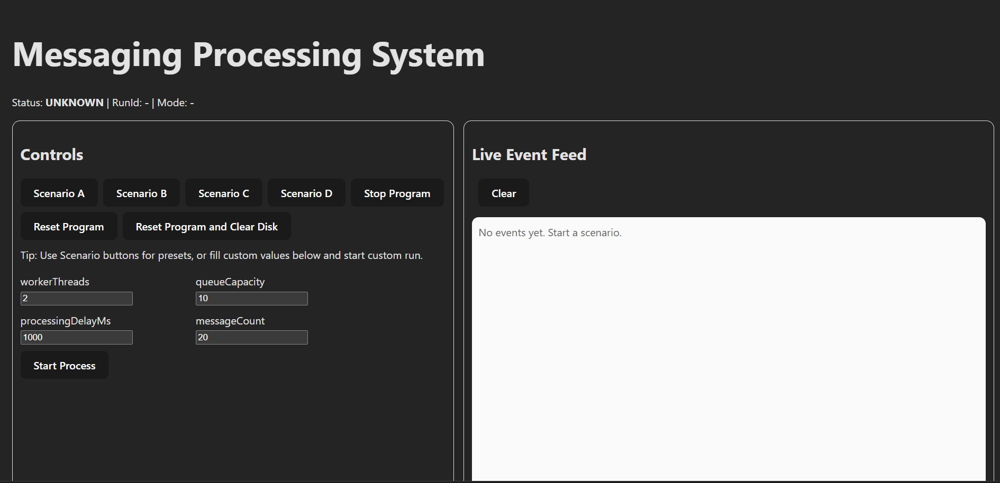

# Disk-Backed Message Processing System (Kafka-Inspired)



## Overview
This project implements a **Kafka-inspired message processing system** in pure Java.  
It focuses on **backpressure**, **bounded concurrency**, **disk persistence**, and **graceful shutdown**.

The purpose of this project is to explore and demonstrate real-world system design problems:
- How to handle producer–consumer imbalance
- How to prevent unbounded memory growth
- How to use disk as a safety buffer under load
- How to shut down concurrent systems without data loss

A **simple in-memory implementation** is included for comparison.

---

## Technology Stack
**Backend**
- Java
- Maven
- RESTful API design

**Frontend**
- JavaScript / TypeScript
- Modern frontend tooling (via npm)

**Infrastructure**
- Docker
- Docker Compose

---

## Prerequisites
Ensure the following tools are installed:
- Java 17 or higher
- Maven
- Node.js 18 or higher
- npm
- Docker & Docker Compose

## Running the Project
**Option 1: Run with Docker (Recommended)**
This is the easiest and most consistent way to run the entire system.
```
docker-compose up --build
```
**Once started:**
- Backend API: http://localhost:8080
- Frontend UI: http://localhost:5173

---

## Key Concepts
- Backpressure using `Semaphore`
- Bounded `ThreadPoolExecutor`
- Disk-backed queue with file persistence
- Explicit locking with `ReentrantLock` and `Condition`
- Graceful shutdown without task loss
- Producer / consumer decoupling

---

## Features

### Kafka-Style System
- **Disk-backed queue**
  - Tasks are persisted when memory capacity is exceeded
  - Prevents message loss during load spikes
- **Explicit backpressure**
  - Global capacity defined as `workerThreads + inMemoryQueueCapacity`
  - Producers must acquire permits before submitting tasks
- **Custom worker thread pool**
  - Fixed number of worker threads
  - Bounded in-memory queue
- **Dedicated drainer thread**
  - Restores tasks from disk when capacity becomes available
  - Uses `Condition` for efficient waiting (no busy-waiting)
- **Graceful shutdown**
  - Stops accepting new tasks
  - Drains disk queue completely
  - Terminates executor cleanly

### Simple In-Memory System
- In-memory queue only
- No persistence
- No backpressure
- Included as a baseline comparison

---

## Project Structure
```
.
├── messaging-api/        # Backend REST API (Java)
├── messaging-engine/     # Backend Message Processing Engine (Java)
├── messaging-ui/         # Frontend Web UI
├── docker-compose.yml    # Unified setup for local development
├── .project
└── README.md


messaging-engine/
└── src/
  └── org.main.project
  ├── kafka_style_sys
  │ ├── MainExecutorClass.java
  │ ├── worker
  │ │ └── WorkerThreadPool.java
  │ ├── service
  │ │ ├── DiskQueue.java
  │ │ ├── FileDiskQueue.java
  │ │ └── IndexMapService.java
  │ └── record
  │ └── DiskRecord.java
  │
  └── simple_msg_sys
  ├── MainClass.java
  └── inmemsys
  └── InMemorySystem.java
```

---

## Architecture Overview
1. Producer submits a task
2. A `Semaphore` enforces global capacity
3. If memory is available → task goes to the executor
4. If memory is full → task is written to disk
5. Drainer thread moves tasks from disk back into memory
6. Workers process tasks and release permits

This guarantees:
- Bounded memory usage
- No task loss
- Predictable behavior under load

---

## Design Decisions

### Disk-Backed Queue
- Disk acts as a **pressure buffer**, not the primary queue
- Append-only file design
- Thread-safe via explicit locking

### Backpressure via Semaphore
```java
Semaphore permits = new Semaphore(capacity);
```

- Each task must acquire a permit
- Permit is released only after task completion
- Naturally slows producers under load

### Bounded ThreadPoolExecutor

- Fixed worker count
- Fixed queue size
- Avoids dangerous unbounded executors

### Drainer Thread

- Independent from workers
- Uses `Condition.await()` instead of polling
- CPU-efficient and scalable

### Graceful Shutdown

Shutdown sequence:

1. Stop accepting new tasks
2. Drain disk queue
3. Stop drainer thread
4. Shut down executor
5. Close file resources

Result: **no data loss and deterministic shutdown**

---

## Running the Project

### Kafka-Style System
```bash
java org.main.project.kafka_style_sys.MainExecutorClass
```

### Simple In-Memory System
```bash
java org.main.project.simple_msg_sys.MainClass
```

---

## Key Takeaways
- Backpressure is essential for stability
- Disk can act as a safety mechanism under load
- Thread pools must be designed carefully
- Shutdown logic is critical in concurrent systems
